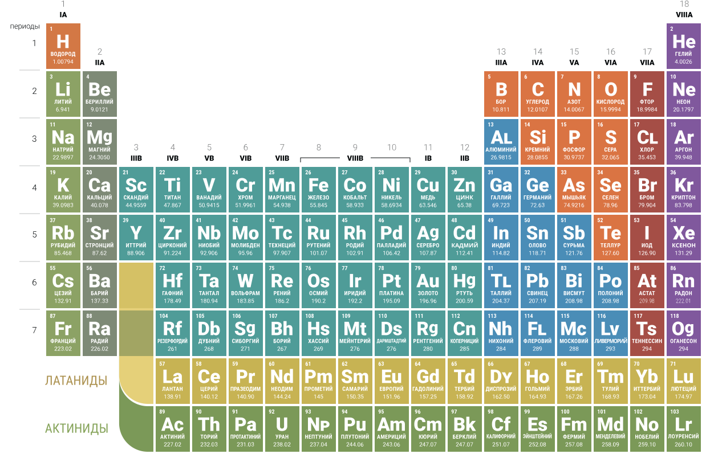

# Chemistry

Нормальные условия — 0℃, 101.3Pa.

## Ряд активности металлов

Li Rb K Ba Sr Ca Na Mg Al Mn Zn Cr Fe Co Ni Sn Pb **H** Sb Cu Hg Ag Pt Au

## Валентность

Элементы с постоянной валентностью

| Элемент | Валентность |
| --- | --- |
| H, Li, F, Na, K, Ag | I |
| Be, O, Mg, Ca, Zn, Ba | II |
| Al | III |

Элементы с переменной валентностью

| Элемент | Валентность |
| --- | --- |
| Cu | I, II |
| N | I, II, III, IV |
| Cl, Br, I | I, III, V, VII |
| Fe | II, III |
| C, Si | II, IV |
| S | II, IV, VI |
| P | III, V |

## Степень окисления

Степень окисления водорода в соединениях с неметаллами равна +1, а в соединениях с металлами — -1.

Степень окисления кислорода равна -2 (исключения: $OF_2$ +2, $H_2O_2$ -1)

Степень окисления фтора всегда равна -1.

Степень окисления металла положительная и совпадает с его валентностью.

Степень окисления неметалла может быть как положительной так и отрицательной. Численное значение совпадают с валентностью.

## Оксиды

### Основные

Образуются металлами степень окисления как правило является не высокой: +1 или +2.

$Na_2O$,
$MgO$
$CaO$,
$CuO$,
$FeO$

### Кислотные

Образуются неменаллами, а также могут обазовываться металлами с высокой степерью окисления: от 5 до 7.

$CO_2$,
$NO_2$,
$SiO_2$,
$SO_2$,
$P_2O_5$,
$SO_3$,
$CrO_3$,
$Cl_2O_7$,
$Mn_2O_7$

### Амфотерные

$Cu_2O$
$BeO$,
$ZnO$,
$PbO$,
$Al_2O_3$,
$Fe_2O_3$,
$TiO_2$

Если металлический элемент имеет переменную валентность, то из всех образуемых им оксидов амфотерными свойствами обладают те, в которых элемент имеет промежуточную валентность.

$Cr_2O_3$

### Несолеобразующие

$CO$,
$SiO$,
$N_2O$,
$NO$

## Основания

### Щёлочи

#### Хорошо растворимые

$LiOH$,
$NaOH$,
$KOH$,
$RbOH$,
$CsOH$,
$FrOH$,
$Ba(OH)_2$,
$Ra(OH)_2$

$2Na + 2H_2O \to 2NaOH + H_2 \uparrow$

$Li_2O + H_2O \to 2LiOH$

$2NaCl + 2H_2O \overset{e}{\to} 2NaOH + H_2 \uparrow + Cl_2 \uparrow$

#### Малорастворимые

$Ca(OH)_2$,
$Sr(OH)_2$

$Ca + 2H_2O \to Ca(OH)_2 + H_2O \uparrow$

$CaO + H_2O \to Ca(OH)_2$

### Практически нерастворимые

$CuOH$
$Mg(OH)_2$
$Cu(OH)_2$,
$Cr(OH)_2$,
$Mn(OH)_2$,
$Fe(OH)_2$,
$Ni(OH)_2$,
$Fe(OH)_3$

$CuCl_2 + 2KOH \to Cu(OH)_2 \downarrow + 2KCl$

$FeCl_3 + 3NaOH \to Fe(OH)_3 \downarrow + 3NaCl$

## Кислоты

| Название | Формула | Соль |
| --- | --- | --- |
| Фтороводороданя (плавиковая) | $HF$ | Фторид |
| Хлороводородная (соляная) | $HCl$ | Хлорид |
| Хлорная | $HClO_4$ | Перхлорат |
| Хлорноватистая | $HClO$ | Гипохлорит |
| Бромоводородная | $HBr$ | Бромид |
| Иодоводородная | $HI$ | Иодид |
| Сероводородная | $H_2S$ | Сульфид |
| Серная | $H_2SO_4$ | Сульфат |
| Сернистая | $H_2SO_3$ | Сульфит |
| Азотная | $HNO_3$ | Нитрат |
| Азотистая | $HNO_2$ | Нитрит |
| Фосфорная (ортофосфорная) | $H_3PO_4$ | Фосфат (ортофосфат) |
| Метафосфорная | $HPO_3$ | Метафосфат |
| Угольная | $H_2CO_3$ | Карбонат |
| Муравьиная | $HCOOH$ | Формиат |
| Уксусная | $CH_3COOH$ | Ацетат |
| Щавелевая | $H_2C_2O_4$ | Оксалат |
| Кремниевая | $H_2SiO_3$ | Силикат |
| Борная | $H_3BO_3$ | Борат |
| Пермарганцовая | $HMnO_4$ | Перманганат |
| Марганцовая | $H_2MnO_4$ | Манганат |
| Двухромовая | $H_2Cr_2O_7$ | Дихромат |
| Хромовая | $HCrO_4$ | Хромат |
| Метаалюминиевая | $HAlO_2$ | Алюминат |
| Тетрагидроксоалюминиевая | $H[Al(OH)_4]$ | Тетрагидроксоалюминат |
| Гексагидроксоалюминиевая | $H_3[Al(OH)_6]$ | Гексагидроксоалюминат |
| Цинковая | $H_2ZnO_2$ | Цинкат |
| Тетрагидроксоцинковая | $H_2[Zn(OH)_4]$ | Тетрагидроксоцинкат |

### Сильные

$H_2SO_4$,
$HNO_3$,
$HCl$,

$HBr$,
$HI$

### Средние

$H_3PO_4$,
$H_2SO_3$,

$HF$,
$HNO_2$

### Слабые

$H_2CO_3$,
$CH_3COOH$,
$H_2S$,
$H_2SiO_3$

$H_3BO_3$

### Вытеснительный ряд кислот

- $H_2SO_4$
- $HNO_3$, $HCl$, $H_3PO_4$
- $H_2SO_3$
- $H_2CO_3$
- $CH_3COOH$
- $H_2S$
- $H_2SiO_3$

### Неустойчивые

$H_2CO_3$, $H_2SO_3$, $H_2Si_O3$, $HNO_3$

### Летучесть

Летучие: $HCl$, $H_2S$, $HNO_3$

Нелетучие: $H_2SO_4$, $HI$, $H_3PO_4$, $H_2SiO_3$, etc.

## Амфотерные гидроксиды

$Zn(OH)_2$,
$Be(OH)_2$,
$Pb(OH)_2$,
$Sn(OH)_2$

$Al(OH)_3$,
$Cr(OH)_3$

$Mn(OH)_4$,
$Pb(OH)_4$

## Соли

Соль — сложное вещество состоящее из металлического элемента или одновалентной группы аммония ($NH_4$) и кислотного остатка.

| Тривиальное название | Химическая формула | Систематическое название |
| --- | --- | --- |
| Адский камень, ляпис | $AgNO_3$ | нитрат серебра |
| Берлинская лазурь | $KFe[Fe(CN)_6]$ | гексацианоферрат(II) железа(III)-калия |
| Бланфикс | $BaSO_4$ | сульфат бария |
| Бура | $Na_2B_4O_7 \cdot 10H_2O$ | декагидрат тетрабората натрия |
| Бура ювелирная | $Na_2B_4O_7 \cdot 5H_2O$ | пентагидрат тетрабората натрия |
| Гипс | $CaSO_4 \cdot 2H_2O$ | дигидрат сульфата кальция |
| Гипс жжёный/строительный, алебастр | $CaSO_4 \cdot 0.5H_2O$ | гемигидрат сульфата кальция |
| Золото муссивное | $SnS_2$ | сульфид олова(IV) |
| Квасцы алюмокалиевые | $KAl(SO_4)_2 \cdot 12H_2O$ | додекагидрат сульфата алюминия-калия |
| Квасцы железоаммонийные | $NH_4Fe(SO_4)_2 \cdot 12H_2O$ | додекагидрат сульфата железа(III)-аммония |
| Купорос медный | $CuSO_4 \cdot 5H_2O$ | пентагидрат сульфата меди(II) |
| Марганцовка | $KMnO_4$ | перманганат калия |
| Мел | $CaCO_3$ | карбонат кальция |
| Нашатырь | $NH_4Cl$ | хлорид аммония |
| Патина | $(CuOH)_2CO_3$ | гидроксокарбонат меди(II) |
| Поташ, щёлок | $K_2CO_3$ | карбонат калия |
| Преципитат | $CaHPO_4 \cdot 2H_2O$ | дигидрат гидрофосфата кальция |
| Растворимое стекло | $Na_2SiO_3 \cdot 9H_2O$ | нонагидрат силиката натрия |
| Свинцовый сахар | $(CH_3COO)_2Pb \cdot 3H_2O$ | тригидрат ацетата свинца(II) |
| Селитра аммиачная (аммонийная) | $NH_4NO_3$ | нитрат аммония |
| Селитра калийная (индийская) | $KNO_3$ | нитрат калия |
| Селитра кальциевая (норвежская) | $Ca(NO_3)_2$ | нитрат кальция |
| Селитра натриевая (чилийская) | $NaNO_3$ | нитрат натрия |
| Сода кальцинированная (стиральная) | $Na_2CO_3$ | карбонат натрия |
| Сода кристаллическая | $Na_2CO_3 \cdot 10H_2O$ | декагидрат карбоната натрия |
| Сода питьевая/пищевая | $NaHCO_3$ | гидрокарбонат натрия |
| Соль Мора | $(NH_4)_2Fe(SO_4)_2 \cdot 6H_2O$ | гексагидрат сульфата железа(II)-диаммония |
| Соль английская (горькая) | $MgSO_4 \cdot 7H_2O$ | гептагидрат сульфата магния |
| Соль бертолетова | $KClO_3$ | хлорат калия |
| Соль глауберова | $Na_2SO_4 \cdot 10H_2O$ | декагидрат сульфата натрия |
| Соль жёлтая кровяная | $K_4[Fe(CN)_6] \cdot 10H_2O$ | декагидрат гексацианоферрата(II) калия |
| Соль поваренная | $NaCl$ | хлорид натрия |
| Соль красная кровяная | $K_3[Fe(CN)_6]$ | гексацианоферрат(III) калия |
| Сулема | $HgCl_2$ | хлорид ртути |
| Суперфосфат двойной | $Ca(H_2PO_4)_2 \cdot H_2O$ | моногидрат дигидрофосфата кальция |
| Суперфосфат простой | $Ca(H_2PO_4)_2 \cdot 2CaSO_4$ | |
| Турнбулева синь | $KFe[Fe(CN)_6]$ | гексацианоферрат(III) железа(II)-калия |
| Хлорная известь | $CaOCl_2$ | гипохлорит-хлорид кальция |
| Хромпик | $K_2Cr_2O_7$ | дихромат калия |

### Средние

### Кислые

В состав кислых солей, кроме металлического химического элемента, входят атомы водорода.

### Основные

В состав основных солей, кроме металлического химического элемента и кислотного остатка, входят гидроксогруппы.

### Комплексные

Координационное число:

- 2 — Ag?
- 4 — Cu(II), Be, Zn
- 6 — Al, Fe, Cr(III)

### Растворимость

| Соли | Растворимость |
| --- | --- |
| Нитраты, ацетаты | Практически все хорошо растворимы |
| Соли щелочных металлов (натрия, калия) и аммония | Практически все хорошо растворимы |
| Хлориды, бромиды, иодиды | Большей частью хорошо растворимы. Практичесески нерастворимы $AgCl$ и $PbCl_2$. Растворимость галогенидов свинца(II) с повышением температуры резко возрастает |
| Сульфаты | Большей частью хорошо растворимы. Малорастворимы $Ag_2SO_4$ и $CaSO_4$. Практически нерастворимы $PbSO_4$, $SrSO_4$, $BaSO_4$ |
| Фосфаты, карбонаты, сульфиты, силикаты | Практически все нерастворимы, за исключением солей щелочных металлов (натрия, калия) и аммония |
| Сульфиды | Практически все нерастворимы, за исключение солей щелочных, целочноземельных металлов и аммония |
| Кислые соли | Растворимы намного лучше, чем средние |
